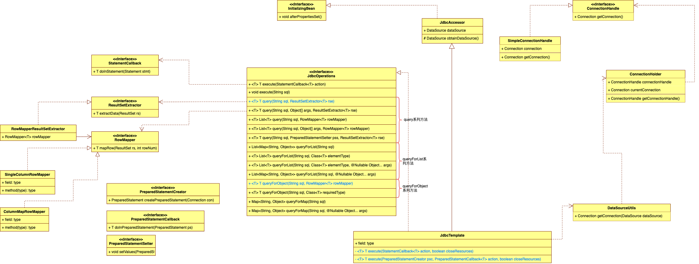

# 一、前言

对于JdbcTemplate的使用你或许已经十分熟练，但对于JDBC的使用你还记得多少？有了新欢忘了旧爱。但对于下面这一系列套路操作你应该不会陌生。

- 配置数据库账号、密码、连接信息等参数
- 打开数据库连接
- 根据业务需求编写sql语句
- 预编译并执行sql语句
- 处理执行结果
- 处理抛出的异常
- 处理事务
- 关闭数据库连接

Spring对上述过程进行抽象化，处理了大部分通用的步骤形成spring-jdbc模块。spring-jdbc接收参数信息、JdbcTemplate接收业务需求sql进行处理并返回结果，应用返回结果数据。

# 二、目标

这里就来实现spring-jdbc所完成的通用步骤，在此之前会先熟悉下JDBC的原始操作，因为spring-jdbc是对JDBC封装。

# 三、设计



**DataSource**

用来提供Connection，之所以有那么多辅助类（ConnectionHanlder、ConnectionHandle）是为了可以和数据库事务结合

**JdbcTemplate**

这个类是进行执行操作的入口类，里面有很多重载方法。

- <T> T execute(StatementCallback<T> action, boolean closeResources)

  这个是JdbcTemplate内部的私有实现方法，JdbcOperations接口中定义的一系列execute()方法也是调用的该方法


**JdbcOperations**

这个接口定义了非常多的入口方法，实现类就是JdbcTemplate

- <T> T query(String sql, ResultSetExtractor<T> rse)

- <T> T query(String sql, ResultSetExtractor<T> rse)

  这个是query系列方法的最后调用方法，该方法会调用JdbcTemplate内部的私有execute方法。

**ResultSetExtractor**

进行数据库查询之后会得到结果集即：ResultSet，这个类用于结果集数据提取

**RowMapper**

用于将结果集每行数据转换为需要的类型

# 四、实现

## 4.1 JDBC基本操作

```java
package com.zhangdd.springframework18;

import com.alibaba.druid.pool.DruidDataSource;
import com.mysql.cj.jdbc.Driver;
import org.junit.After;
import org.junit.Before;
import org.junit.Test;

import java.sql.*;

/**
 * @author zhangdd on 2022/2/10
 */
public class JdbcTest {

    /**
     * CREATE TABLE `user` (
     * `id` int NOT NULL AUTO_INCREMENT,
     * `username` varchar(100) DEFAULT NULL,
     * PRIMARY KEY (`id`),
     * UNIQUE KEY `user_id_uindex` (`id`)
     * ) ENGINE=InnoDB AUTO_INCREMENT=3 DEFAULT CHARSET=utf8mb4 COLLATE=utf8mb4_0900_ai_ci
     */

    private DruidDataSource dataSource;
    private Connection connection;
    private Statement statement;

    @Before
    public void init() throws SQLException {
        dataSource = new DruidDataSource();
        dataSource.setDriver(new Driver());
        dataSource.setUrl("jdbc:mysql://localhost:3306/zhangdd?useSSL=false");
        dataSource.setPassword("12345678");
        dataSource.setUsername("root");

        connection = dataSource.getConnection().getConnection();

        statement = connection.createStatement();

    }

    @Test
    public void ddlTest() throws SQLException {

        boolean execute = statement.execute("        CREATE TABLE `user` (\n" +
                "  `id` int NOT NULL AUTO_INCREMENT,\n" +
                "  `username` varchar(100) DEFAULT NULL,\n" +
                "        PRIMARY KEY (`id`),\n" +
                "        UNIQUE KEY `user_id_uindex` (`id`)\n" +
                ") ENGINE=InnoDB AUTO_INCREMENT=1 DEFAULT CHARSET=utf8mb4 COLLATE=utf8mb4_0900_ai_ci");
        System.out.println(execute);
    }

    @Test
    public void dmlTest() throws SQLException {
        statement.executeUpdate("insert into user(username)values (4)");

        statement.executeUpdate("update user set username='小明' where id=4");

        statement.executeUpdate("delete from user where id=5");
    }

    @Test
    public void dqlTest() throws SQLException {
        ResultSet resultSet = statement.executeQuery("select * from user");
        int row = 1;
        while (resultSet.next()) {
            int id = resultSet.getInt(1);
            String username = resultSet.getString("username");
            System.out.printf("第%d行数据:id:%d,username:%s%n", row++, id, username);
        }
    }

    @Test
    public void batchStatementDMLTest() throws SQLException {
        String sql1 = "insert into user(username) values('小王')";
        String sql2 = "insert into user(username) values('小刘')";
        String sql3 = "update  user set username='小刘刘' where username='小刘'";
        statement.addBatch(sql1);
        statement.addBatch(sql2);
        statement.addBatch(sql3);
        int[] result = statement.executeBatch();
        for (int i : result) {
            System.out.printf("执行结果:%d\n", i);
        }
    }

    @Test
    public void preparedStatementDMLTest() throws SQLException {
        String sql = "insert into user(username) values(?)";
        PreparedStatement preparedStatement = connection.prepareStatement(sql);
        preparedStatement.setString(1, "小李");
        int result = preparedStatement.executeUpdate();
        System.out.println(result);
    }

    @Test
    public void preparedStatementDQLTest() throws SQLException {
        String sql = "select * from user where id=? and username=?";
        PreparedStatement preparedStatement = connection.prepareStatement(sql);
        preparedStatement.setInt(1, 1);
        preparedStatement.setString(2, "小张");


        ResultSet resultSet = preparedStatement.executeQuery();
        int row = 1;
        while (resultSet.next()) {
            int id = resultSet.getInt(1);
            String username = resultSet.getString("username");
            System.out.printf("第%d行数据:id:%d,username:%s%n", row++, id, username);
        }
    }

    @After
    public void destroy() throws SQLException {
        if (null != statement) {
            statement.close();
        }
        if (null != connection) {
            connection.close();
        }
        if (null != dataSource) {
            dataSource.close();
        }
    }
}

```

## 4.2 spring-jdbc实现

### 工程结构

### **DataSourceUtils**

提供Connection

```java
public abstract class DataSourceUtils {


    public static Connection getConnection(DataSource dataSource) {
        try {
            return doGetConnection(dataSource);
        } catch (SQLException e) {
            throw new CannotGetJdbcConnectionException("Failed to obtain JDBC Connection", e);
        }
    }

    public static Connection doGetConnection(DataSource dataSource) throws SQLException {
        Connection connection = fetchConnection(dataSource);
        ConnectionHolder holderToUse = new ConnectionHolder(connection);

        return connection;
    }

    private static Connection fetchConnection(DataSource dataSource) throws SQLException {
        Connection conn = dataSource.getConnection();
        if (null == conn) {
            throw new IllegalArgumentException("DataSource return null from getConnection():" + dataSource);
        }
        return conn;
    }
}
```

### **JdbcTemplate**

内部完成核心方法

```java
public class JdbcTemplate extends JdbcAccessor implements JdbcOperations {


    private <T> T execute(StatementCallback<T> action, boolean closeResources) {
        Connection con = DataSourceUtils.getConnection(obtainDataSource());

        Statement stmt = null;
        try {
            stmt = con.createStatement();
            applyStatementSettings(stmt);

            return action.doInStatement(stmt);

        } catch (SQLException e) {
            String sql = getSql(action);
            JdbcUtils.closeStatement(stmt);
            stmt = null;
            throw translateException("ConnectionCallback", sql, e);
        } finally {
            if (closeResources) {
                JdbcUtils.closeStatement(stmt);
            }
        }
    }

    private <T> T execute(PreparedStatementCreator psc, PreparedStatementCallback<T> action, boolean closeResources) {

        Assert.notNull(psc, "PreparedStatementCreator must not be null");
        Assert.notNull(action, "Callback object must not be null");


        Connection con = DataSourceUtils.getConnection(obtainDataSource());
        PreparedStatement ps = null;
        try {
            ps = psc.createPreparedStatement(con);
            applyStatementSettings(ps);
            T result = action.doInPreparedStatement(ps);
            return result;
        } catch (SQLException ex) {

            String sql = getSql(psc);
            psc = null;
            JdbcUtils.closeStatement(ps);
            ps = null;
            DataSourceUtils.releaseConnection(con, getDataSource());
            con = null;
            throw translateException("PreparedStatementCallback", sql, ex);
        } finally {
            if (closeResources) {

                JdbcUtils.closeStatement(ps);
                DataSourceUtils.releaseConnection(con, getDataSource());
            }
        }
    }

    public <T> T query(
            PreparedStatementCreator psc, final PreparedStatementSetter pss, final ResultSetExtractor<T> rse) {

        Assert.notNull(rse, "ResultSetExtractor must not be null");

        return execute(psc, new PreparedStatementCallback<T>() {
            @Override
            public T doInPreparedStatement(PreparedStatement ps) throws SQLException {
                ResultSet rs = null;
                try {
                    if (pss != null) {
                        pss.setValues(ps);
                    }
                    rs = ps.executeQuery();
                    return rse.extractData(rs);
                } finally {
                    JdbcUtils.closeResultSet(rs);
                }
            }
        }, true);
    }
}
```

### **JdbcOperations**

```java
public interface JdbcOperations {

    <T> T execute(StatementCallback<T> action);

    void execute(String sql);

    //---------------------------------------------------------------------
    // query
    //---------------------------------------------------------------------

    <T> T query(String sql, ResultSetExtractor<T> res);

    <T> T query(String sql, Object[] args, ResultSetExtractor<T> rse);

    <T> List<T> query(String sql, RowMapper<T> rowMapper);

    <T> List<T> query(String sql, Object[] args, RowMapper<T> rowMapper);

    <T> T query(String sql, PreparedStatementSetter pss, ResultSetExtractor<T> rse);

    //---------------------------------------------------------------------
    // queryForList
    //---------------------------------------------------------------------

    List<Map<String, Object>> queryForList(String sql);

    /**
     * 查询数据库表中某一个字段
     */
    <T> List<T> queryForList(String sql, Class<T> elementType);

    <T> List<T> queryForList(String sql, Class<T> elementType, Object... args);

    List<Map<String, Object>> queryForList(String sql, Object... args);

    //---------------------------------------------------------------------
    // queryForObject
    //---------------------------------------------------------------------

    <T> T queryForObject(String sql, RowMapper<T> rowMapper);

    <T> T queryForObject(String sql, Object[] args, RowMapper<T> rowMapper);

    /**
     * 查询数据库表中 某一条记录的 某一个字段
     */
    <T> T queryForObject(String sql, Class<T> requiredType);

    //---------------------------------------------------------------------
    // queryForMap
    //---------------------------------------------------------------------

    Map<String, Object> queryForMap(String sql);

    Map<String, Object> queryForMap(String sql, Object... args);


}

```

### **ResultSetExtractor**

```java
public interface ResultSetExtractor<T> {

    T extractData(ResultSet rs) throws SQLException;
}

```

# 五、测试

## 准备

### sql表结构

```sql
CREATE TABLE `user` (
  `id` int NOT NULL AUTO_INCREMENT,
  `username` varchar(100) DEFAULT NULL,
  PRIMARY KEY (`id`),
  UNIQUE KEY `user_id_uindex` (`id`)
) ENGINE=InnoDB AUTO_INCREMENT=1 DEFAULT CHARSET=utf8mb4 COLLATE=utf8mb4_0900_ai_ci
```

## 测试用例

```java
package cn.bugstack.springframework.test;


import cn.bugstack.springframework.context.support.ClassPathXmlApplicationContext;
import cn.bugstack.springframework.jdbc.support.JdbcTemplate;
import org.junit.Before;
import org.junit.Test;

import java.util.List;
import java.util.Map;

/**
 * @author zhangdd on 2022/1/28
 */
public class ApiTest {

    private JdbcTemplate jdbcTemplate;

    @Before
    public void init() {
        ClassPathXmlApplicationContext applicationContext = new ClassPathXmlApplicationContext("classpath:spring.xml");
        jdbcTemplate = applicationContext.getBean(JdbcTemplate.class);
    }


    @Test
    public void executeSqlTest() {

        jdbcTemplate.execute("        CREATE TABLE `user` (\n" +
                "  `id` int NOT NULL AUTO_INCREMENT,\n" +
                "  `username` varchar(100) DEFAULT NULL,\n" +
                "        PRIMARY KEY (`id`),\n" +
                "        UNIQUE KEY `user_id_uindex` (`id`)\n" +
                ") ENGINE=InnoDB AUTO_INCREMENT=1 DEFAULT CHARSET=utf8mb4 COLLATE=utf8mb4_0900_ai_ci");
    }


    @Test
    public void queryForListTest() {
        List<Map<String, Object>> allResult = jdbcTemplate.queryForList("select * from user");
        for (int i = 0; i < allResult.size(); i++) {
            System.out.printf("第%d行数据", i + 1);
            Map<String, Object> objectMap = allResult.get(i);
            System.out.println(objectMap);
        }
    }

    @Test
    public void queryListWithColumnClassTypeTest() {
        List<String> allResult = jdbcTemplate.queryForList("select username from user", String.class);
        for (int i = 0; i < allResult.size(); i++) {
            System.out.printf("第%d行数据", i + 1);
            String username = allResult.get(i);
            System.out.println(username);
        }
    }

    @Test
    public void queryListWithColumnClassTypeWithArgTest() {
        List<String> allResult = jdbcTemplate.queryForList("select username from user where id=?", String.class, 1);
        for (int i = 0; i < allResult.size(); i++) {
            System.out.printf("第%d行数据", i + 1);
            String username = allResult.get(i);
            System.out.println(username);
        }
    }

    @Test
    public void queryListWithArgTest() {
        List<Map<String, Object>> allResult = jdbcTemplate.queryForList("select * from user where id=?", 1);
        for (int i = 0; i < allResult.size(); i++) {
            System.out.printf("第%d行数据", i + 1);
            Map<String, Object> row = allResult.get(i);
            System.out.println(row);
        }
    }

    @Test
    public void queryObjectTest() {
        String username = jdbcTemplate.queryForObject("select username from user where id=1", String.class);
        System.out.println(username);
    }

    @Test
    public void queryMapTest() {
        Map<String, Object> row = jdbcTemplate.queryForMap("select * from user where id=1");
        System.out.println(row);
    }

    @Test
    public void queryMapWithArgTest() {
        Map<String, Object> row = jdbcTemplate.queryForMap("select * from user where id=?", 1);
        System.out.println(row);
    }
}

```

