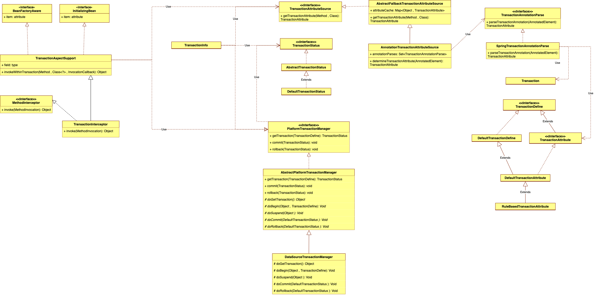
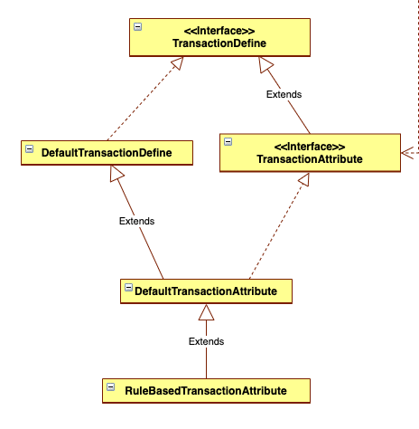
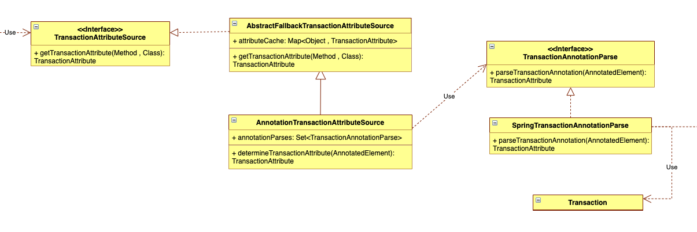
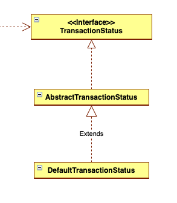
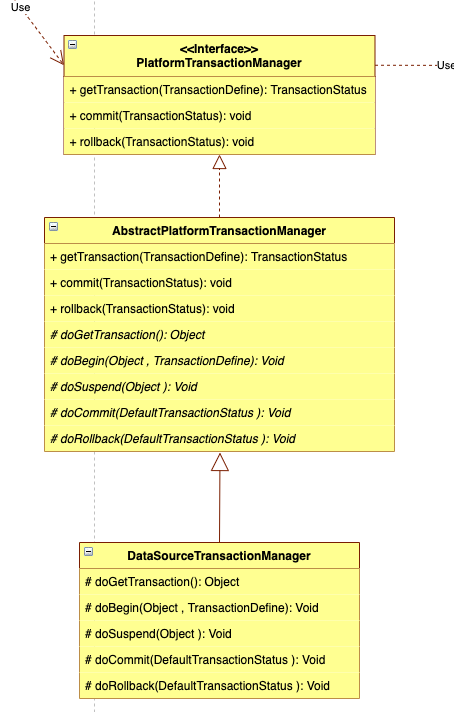
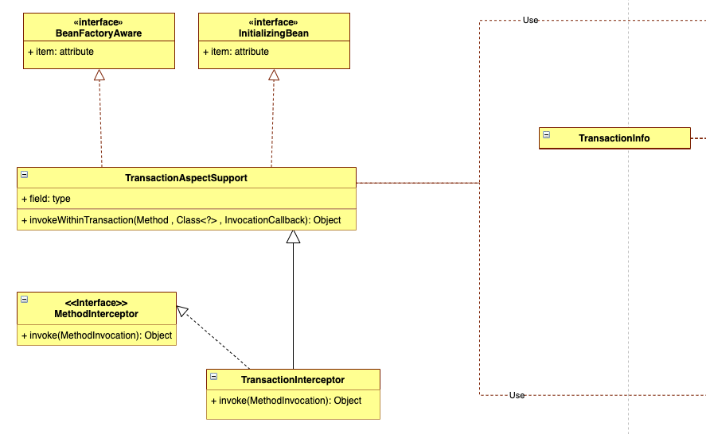

# 一、准备知识

没有事务的数据库是不完整的数据库😄，本篇旨在以Spring声明式事务为纲领进行**事务操作流程**的描述，所以会简化事务的隔离级别和传播特性。

## 1.1 Spring支持的事务管理

Spring支持两种方式管理事务：

- 声明式事务
  - 基于aop，在目标方法前后进行拦截。
  - 在目标方法开始之前创建或者加入一个事务（根据事务的传播属性），进行目标方法的执行，在目标方法执行结束后根据执行情况提交或者回滚事务。如果目标方法执行过程中出现异常，也会根据情况进行提交或者回滚事务。
  - 声明式事务的优点是不需要通过编程的方式管理事务，解耦合
- 编程式事务
  - 通过编码方式实现事务，类似JDBC编程实现事务管理
  - 使用TransactionTemplate或者直接使用底层的PlatformTransactionManager，对于编程式事务管理。

## 1.2 声明式事务

声明式事务的也有两种常用的方式。一种是基于基于tx和aop名字空间的xml配置文件，另一种就是基于@Transactional注解。关于两者的详细使用可以参考[spring声明式事务管理方式](https://www.cnblogs.com/niceyoo/p/8732891.html)

## 1.3 再理解aop

> 由于Spring中声明式事务是基于aop，同时这部分内容有很多不同包下相同类名的类。所以这里对aop概念在进行描述定位一下。

aop的解释是：面向切面编程。

aopalliance：许多对Aop和Java有浓厚兴趣的软件开发人员联合成立了一个[开源项目 aopalliance](http://aopalliance.sourceforge.net/)，这个项目可以认为是aop的定义规范。

aspectj：是基于aop定义实现的优秀项目

spring aop：spring将aopalliance的代码编译到了自己项目中，按照aop的定义重新实现的。同时spring aop 还使用了aspectj中的一些功能用来解析切入点表达式

# 二、JDBC事务和自定义代理管理事务

不知道你还记不记得大明湖畔的夏雨荷，但是使用JDBC操作事务八成是不记得了。

所以本篇章先对JDBC管理事务熟悉一下，然后如果让你使用aop进行实现事务管理会怎么实现。

## 2.1 JDBC管理事务

```java
    @Before
    public void init() throws SQLException {
        dataSource = new DruidDataSource();
        dataSource.setDriver(new Driver());
        dataSource.setUrl("jdbc:mysql://localhost:3306/zhangdd?useSSL=false");
        dataSource.setPassword("12345678");
        dataSource.setUsername("root");

        connection = dataSource.getConnection().getConnection();

        statement = connection.createStatement();

    }

    @Test
    public void saveDataWithTranslation() throws SQLException {

        connection.setAutoCommit(false);
        try {
            statement.execute("insert into teacher(teacher_name) values ('王老师')");

            statement.execute("insert into user(id,username) values(1,'重复数据')");
        } catch (Exception e) {
            e.printStackTrace();
            connection.rollback();
        }

    }
```

## 2.2 自定义代理管理事务

```java
package com.zhangdd.springframework19;

import java.lang.reflect.InvocationHandler;
import java.lang.reflect.InvocationTargetException;
import java.lang.reflect.Method;
import java.sql.Connection;

/**
 * @author zhangdd on 2022/2/15
 */
public class TransactionProxy implements InvocationHandler {

    private final Connection connection;

    private final Object target;

    public TransactionProxy(Connection connection, Object target) {
        this.connection = connection;
        this.target = target;
    }

    @Override
    public Object invoke(Object proxy, Method method, Object[] args) throws Throwable {

        //开启事务
        connection.setAutoCommit(true);

        //如果发生异常则进行回滚
        Object invokeResult = null;
        try {
            invokeResult = method.invoke(target, args);
        } catch (IllegalAccessException | InvocationTargetException | IllegalArgumentException e) {
            e.printStackTrace();
            connection.rollback();
        }

        //提交
        connection.commit();

        return invokeResult;
    }
}
```


```java
@Test
public void saveDataWithTranslationProxy() throws SQLException {
    JdbcService jdbcService=new JdbcServiceImpl(statement);

    TransactionProxy transactionProxy=new TransactionProxy(connection,jdbcService);

    JdbcService jdbcServiceProxy = (JdbcService) Proxy.newProxyInstance(jdbcService.getClass().getClassLoader(),
            jdbcService.getClass().getInterfaces(), transactionProxy);

    jdbcServiceProxy.saveDataWithTranslation();
}
```

框架就是提取各个场景下相同的内容，将其抽象成模版。从上面操作事务的代码可以发现事务操作的规律：

- setAutoCommit(true) 开启事务
- invoke(target, args) 执行业务代码
- connection.rollback() 或者 connection.commit()，回滚或者提交事务

# 三、Spring中的声明式事务

铺垫了那么多终于进入正题了。

## 3.1 相关类及接口描述

这里先给出一个完整的uml关系图，然后在分块去描述作用。



### 3.1.1 事务的定义相关描述



- TransactionDefine
  - 这是一个接口，定义了事务的一些属性。比如事务的传播性、事务隔离级别、超时时间等
- DefaultTransactionDefinition
  - 这个类是TransactionDefine接口的实现类。用来设置事务的传播、隔离、超时等属性

---

- TransactionAttribute

  - 直接看这个接口的名字含义是属性的属性。确实如此，这个接口继承TransactionDefine，添加了一个`rollbackOn(Throwable ex)`方法。在进行事务回滚前用来判断对于当前发生的异常是否需要回滚。

- DefaultTransactionAttribute

  - 这个类并没做特殊的事情，就是常规属性的设置
  - 对于`rollbackOn(Throwable ex)`这个方法在这里进行了实现。如果当前异常是运行时异常或者error，那么返回的是ture

  ```java
  public boolean rollbackOn(Throwable ex) {
     return (ex instanceof RuntimeException || ex instanceof Error);
  }
  ```

- RubeBasedTransactionAttribute

  - 这个类比较重要的方法也是`rollbackOn(Throwable ex)`这个方法。对于指定的异常是否应该进行事务回滚，特别是这个规则的判断逻辑可以单独描述下，挺好的。

### 3.1.2 解析事务属性，获取事务



- Transaction

  - 这是作用于方法和类上的标识注解。标识该方法或者该类中的方法应用事务。

- TransactionAnnotationParser

  - 该接口就一个解析方法。用于解析方法或者类上的注解得到事务的属性。

  ```java
  TransactionAttribute parseTransactionAnnotation(AnnotatedElement element);
  ```

- SpringTransactionAnnotationParse

  - 这个类用于实现解析`Transaction`注解，获取业务中设置的相关属性。

  ```java
  protected TransactionAttribute parseTransactionAnnotation(AnnotationAttributes attributes) {
     RuleBasedTransactionAttribute rbta = new RuleBasedTransactionAttribute();
  
     Propagation propagation = attributes.getEnum("propagation");
     rbta.setPropagationBehavior(propagation.value());
     Isolation isolation = attributes.getEnum("isolation");
     rbta.setIsolationLevel(isolation.value());
     rbta.setTimeout(attributes.getNumber("timeout").intValue());
     rbta.setReadOnly(attributes.getBoolean("readOnly"));
     rbta.setQualifier(attributes.getString("value"));
  
     List<RollbackRuleAttribute> rollbackRules = new ArrayList<>();
     for (Class<?> rbRule : attributes.getClassArray("rollbackFor")) {
        rollbackRules.add(new RollbackRuleAttribute(rbRule));
     }
     for (String rbRule : attributes.getStringArray("rollbackForClassName")) {
        rollbackRules.add(new RollbackRuleAttribute(rbRule));
     }
     for (Class<?> rbRule : attributes.getClassArray("noRollbackFor")) {
        rollbackRules.add(new NoRollbackRuleAttribute(rbRule));
     }
     for (String rbRule : attributes.getStringArray("noRollbackForClassName")) {
        rollbackRules.add(new NoRollbackRuleAttribute(rbRule));
     }
     rbta.setRollbackRules(rollbackRules);
  
     return rbta;
  }
  ```

---

- TransactionAttributeSource

  - 该接口可以认为是`TransactionAttribute`的包装接口，该接口中就一个获取`TransactionAttribute`的方法。

  ```java
  TransactionAttribute getTransactionAttribute(Method method, @Nullable Class<?> targetClass);
  ```

- AbstractFallbackTransactionAttributeSource

  - 该抽象类实现了`TransactionAttributeSource`接口，还是按照老套路定义了获取`TransactionAttribute`的模版，真正的获取交给子类去实现。

  ```java
  protected abstract TransactionAttribute findTransactionAttribute(Class<?> clazz);
  
  protected abstract TransactionAttribute findTransactionAttribute(Class<?> clazz);
  ```

- AnnotationTransactionAttributeSource
  - 这个就是用来实际工作的类。读取`Transaction`注解返回一个TransactionAttribute。同时这个类也支持JTA和EJB。
  - 在这个类中比较重要的方法就是`determineTransactionAttribute(AnnotatedElement element)`。在该方法中调用解析事务的类`SpringTransactionAnnotationParse`去完成解析工作。

### 3.1.3 开启事务 & 调用业务方法 & 提交或者回滚



- TransactionStatus
  - 这个接口是对事务的状态进行描述，定义了`Savepoint`、是否是新事务等信息。通过`TransactionDefinition`中的事务属性来创建一个`TransactionStatus`。
- AbstractTransactionStatus
  - 事务状态描述的抽象类
- DefaultTransactionStatus
  - 默认的事务状态描述类

---



- PlatformTransactionManager

  - 这是一个比较重要的接口。定义了获取事务状态、事务提交、事务回滚等方法

  ```java
  TransactionStatus getTransaction(@Nullable TransactionDefinition definition)
  
  void commit(TransactionStatus status)
  
  void rollback(TransactionStatus status)
  ```

- AbstractPlatformTransactionManager

  - 事务管理的抽象实现类。采用同样的套路定义了事务的操作流程，分别是获取事务，事务提交，事务回滚。这三个步骤在不同的数据源上操作又有区别，所以该抽象类同时定义了需要子类去实际执行的抽象方法。

  - ```java
    TransactionStatus getTransaction(@Nullable TransactionDefinition definition)
    ```

    获取事务的方法：

    - 根据当前是否已经有事务，如果有，根据定义的事务传播行为返回一个事务
    - 如果没有根据事务的定义返回一个事务

  - ```java
    void commit(TransactionStatus status)
    ```

    根据事务的状态，准备进行事务的提交操作，真正的提交交给`doRollback(DefaultTransactionStatus status)`

  - ```java
    void rollback(TransactionStatus status)
    ```

    开始准备进行事务回滚

  ---

  定义的关键抽象方法

  - ```java
    abstract Object doGetTransaction()
    ```

    为当前的事务状态返回一个事务对象。得到该对象后在交给其他模版方法去处理

  - ```java
    Object doSuspend(Object transaction)
    ```

    挂起指定的事务

  - ```java
    abstract void doBegin(Object transaction, TransactionDefinition definition)
    ```

    根据给定的事务定义开始一个新事务，在此之前要么没有事务，要么存在的事务已被挂起。所以可以放心大胆的开始一个新事务。

  - ```java
    abstract void doCommit(DefaultTransactionStatus status)
    ```

    对于给定的事务进行提交操作

  - ```java
    abstract void doRollback(DefaultTransactionStatus status)
    ```

    对于指定的事务执行回滚操作

---



- TransactionInfo

  - `TransactionInfo`是`TransactionAspectSupport`的内部类，将`TransactionAttributeSource`、`TransactionStatus`、`PlatformTransactionManager`进行了组合。

- TransactionAspectSupport

  - 这个类也是一个比较重要的类了，实现了`BeanFactoreAware`、`InitializingBean`接口。

  - 另外定义了一个比较重要的方法

    ```java
    Object invokeWithinTransaction(Method method, @Nullable Class<?> targetClass,
          final InvocationCallback invocation)
    ```

    在这个方法里，分别获取`TransactionAttributeSource`、`TransactionAttribute`、`PlatformTransactionManager`。在这里获取到必要参数。开始执行主干流程。

    1. 创建一个`TransactionInfo`此时将事务的内动都打包交给`TransactionInfo`
    2. 调用代理方法去执行业务逻辑。
    3. 如果出现异常进行执行异常
    4. 如果没有异常进行clean操作
    5. 最后进行commit

## 3.2 代码结构


## 3.3 测试用例

```java
@Transactional(rollbackFor = Exception.class)
@Override
public void saveData(JdbcTemplate jdbcTemplate) {
  jdbcTemplate.execute("insert into teacher(teacher_name) values ('李老师')");
  jdbcTemplate.execute("insert into user(id,username) values(1,'重复数据')");
}

@Test
public void jdbcWithTransaction() {

    JdbcService jdbcService = new JdbcServiceImpl();

    AnnotationTransactionAttributeSource transactionAttributeSource = new AnnotationTransactionAttributeSource();
    transactionAttributeSource.findTransactionAttribute(jdbcService.getClass());
    
    DataSourceTransactionManager transactionManager = new DataSourceTransactionManager(dataSource);
    TransactionInterceptor interceptor = new TransactionInterceptor(transactionManager, transactionAttributeSource);
    
    BeanFactoryTransactionAttributeSourceAdvisor btas = new BeanFactoryTransactionAttributeSourceAdvisor();
    btas.setAdvice(interceptor);
    
    AdvisedSupport advisedSupport = new AdvisedSupport();
    advisedSupport.setTargetSource(new TargetSource(jdbcService));
    advisedSupport.setMethodInterceptor(interceptor);
    advisedSupport.setMethodMatcher(btas.getPointcut().getMethodMatcher());
    advisedSupport.setProxyTargetClass(false);

    JdbcService proxyCglib = (JdbcServiceImpl) new Cglib2AopProxy(advisedSupport).getProxy();
    proxyCglib.saveData(jdbcTemplate);
}
```


**执行结果如下**

	cn.bugstack.springframework.jdbc.UncategorizedSQLException: insert into user(id,username) values(1,'重复数据')
	at cn.bugstack.springframework.jdbc.support.JdbcTemplate.translateException(JdbcTemplate.java:149)
	at cn.bugstack.springframework.jdbc.support.JdbcTemplate.execute(JdbcTemplate.java:75)
	at cn.bugstack.springframework.jdbc.support.JdbcTemplate.execute(JdbcTemplate.java:181)
	at cn.bugstack.springframework.test.service.impl.JdbcServiceImpl.saveData(JdbcServiceImpl.java:36)
	at cn.bugstack.springframework.test.service.impl.JdbcServiceImpl$$FastClassByCGLIB$$1ca5c26d.invoke(<generated>)
	at net.sf.cglib.proxy.MethodProxy.invoke(MethodProxy.java:204)

